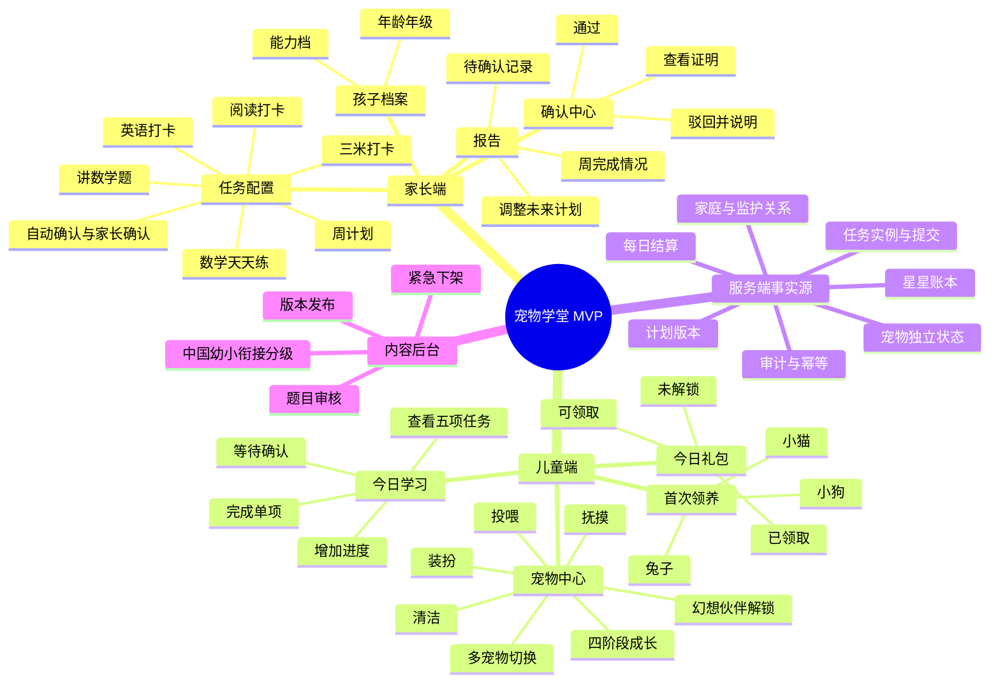

# 宠物学堂研发功能地图

```mermaid
mindmap
  root((宠物学堂 MVP))
    家长端
      孩子档案
        年龄年级
        能力档
      任务配置
        周计划
        阅读打卡
        英语打卡
        三米打卡
        数学天天练
        讲数学题
        自动确认与家长确认
      确认中心
        查看证明
        通过
        驳回并说明
      报告
        周完成情况
        待确认记录
        调整未来计划
    儿童端
      首次领养
        小猫
        小狗
        兔子
      今日学习
        查看五项任务
        完成单项
        增加进度
        等待确认
      今日礼包
        未解锁
        可领取
        已领取
      宠物中心
        投喂
        清洁
        抚摸
        四阶段成长
        多宠物切换
        装扮
        幻想伙伴解锁
    服务端事实源
      家庭与监护关系
      计划版本
      任务实例与提交
      每日结算
      星星账本
      宠物独立状态
      审计与幂等
    内容后台
      中国幼小衔接分级
      题目审核
      版本发布
      紧急下架
```

## 核心纵向切片

`家长配置任务 → 孩子首次领养 → 完成自动判分任务 → 提交需确认任务 → 家长确认 → 今日礼包可领取 → 领取星星 → 投喂当前宠物 → 增加成长值 → 达成门槛后进入下一阶段`。

## MVP 外明确不做

排行榜、社交、抽卡、多货币、儿童端付费、宠物交易繁殖、AI 自由聊天、3D/AR 和微服务拆分。
